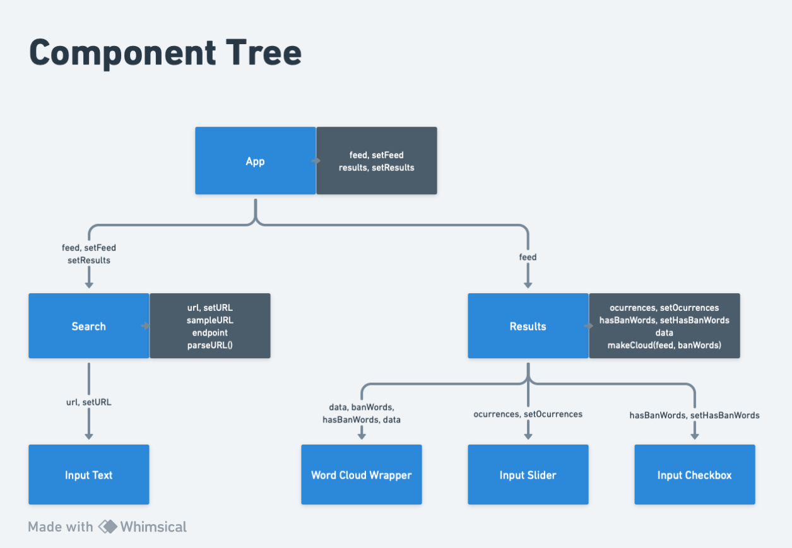

# Mevisio Code Challenge

## Editors note

Hi it was very fun to work on this project. Some notes on the frontend:

- Although it seems an overkill to make a component for each input type, when they are only use once for each type in the whole app, this would allow us to make UI tests using Testing Library 🐙
- Same with the data parsing methods `countReferences()`, `filterByMinimumValue()`, and `formatReferences()` as this allows to test them using Jest.

## What branch to review?

This project has 2 branches:

- `solve-it-in-the-frontend`: The branch given to solve the code challenge. It has an unoptimized version of the code but is easy to read.
- `performance`: Do you care about avoiding expensive operations on the frontend? This branch has you covered! It uses React's `useMemo()` to cache the most expensive operations required to format the word cloud and render the news feed below it. However, the optimization requires extra code to split the method `makeCloud()` into 3 to cache the first 2.

## Project dependencies

- Added `node-fetch` to the backend as it was giving me an error of fetch is not defined. My theory is that I have a different version of Node installed in my machine than the one used to build the backend.
- Added `react-d3-cloud` to render the world cloud on the screen.
- Added `@fortawesome/react-fontawesome` to display nice icons on the navbar and news feed.

## Frontend diagram

This is the frontend diagram/component tree with the props passed down. With more time, or actually on a bigger app we would use ContextAPI or Redux to pass the data down in combination of Router DOM for better page navigation.

## Image credits

- The 3d image of a boy looking at a chart illustration by [Icons 8](https://icons8.com/illustrations/illustration/3d-casual-life-young-man-drawing-a-curve-in-design-program) from [Ouch!](https://icons8.com/illustrations)

## Prerequisites

- A fresh version of Node.js
- Yarn Classic

## Get Up and Running

1. Clone this repository.
2. Run `yarn`.
3. Run `yarn dev` to start the application.
4. Get started on your solution to [the challenge](./CHALLENGE.md)! Good Luck! (Thanks, and done!)
